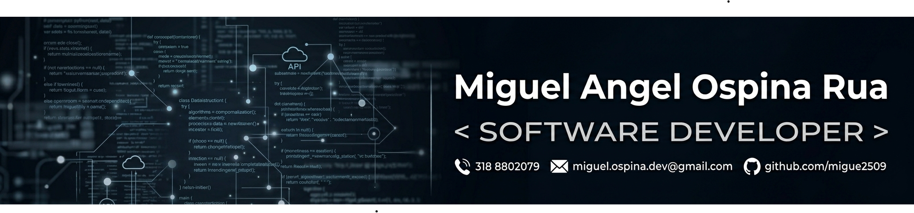

## 🚀 About Me

Soy Tecnólogo en Desarrollo de Software y estudiante de Ingeniería de Software, con enfoque en desarrollo de soluciones Backend,Full Stack y automatización de procesos empresariales.

He participado en el diseño e implementación de sistemas y flujos automatizados orientados a optimizar operaciones, mejorar la trazabilidad de la información y reducir tareas manuales en entornos empresariales.

Cuento con experiencia trabajando con tecnologías como Python, Django, SQL, Power Automate, SharePoint, Excel, SharePoint, BI, aplicándolas en proyectos de gestión interna, automatización de procesos y desarrollo de aplicaciones con arquitectura estructurada.

Me enfoco en transformar necesidades de negocio en soluciones funcionales, escalables y bien organizadas, aportando una visión técnica orientada a la eficiencia, el análisis y la mejora continua.

## 🛠 Tecnologías y herramientas

- **Lenguajes:** Python, DJANGO
- **Data:** Power Bi, SQL
- **RPA:** Power Platform (Power Automate, Sharepoint)
- **Devops:** GitHub&Git
- **Desarrollo Agil:** Scrum
- **Análisis de Software:** Levantamiento de requerimientos, análisis de requerimientos funcionales y no funcionales, documentación de procesos, HU, Casos de uso, criterios de aceptación.

## 📂 Proyectos destacados

### Postulaciones internas
Implementación de un flujo automatizado para la gestión de postulaciones internas, integrando validaciones, formularios, decisiones condicionadas y trazabilidad centralizada para fortalecer el control y seguimiento del proceso.

### Análisis de conocimiento crítico
Desarrollo de una solución para estructurar y consolidar información asociada al conocimiento crítico, facilitando el análisis de datos, la identificación de prioridades y el soporte a la toma de decisiones.

### Gestión de necesidades de formación
Diseño de un proceso orientado a la recolección, organización y seguimiento de necesidades de formación, permitiendo centralizar solicitudes, optimizar la trazabilidad y segurir una modalidad de formación.

### Proyecto GPS
Desarrollo completo de un proyecto de alta relevancia para el area de GH con múltiples etapas de ejecución, enfocado en seguimiento operativo, control de usuarios e integración de información. Incluye centralización de datos, automatización de correos electrónicos, gestión de bases de datos con más de 800 registros y administración de aproximadamente 100 usuarios dentro del flujo operativo.

### APP_juan_chupe_inv
Desarrollo de un software a la medida para la gestión operativa de una tienda de granizados, orientado al control de usuarios, punto de venta (POS), administración de inventario, visualización de métricas y soporte al proceso comercial.

El proyecto se encuentra en desarrollo bajo una arquitectura hexagonal, utilizando **Python**, **Django**, **SQL** y **Docker**, con enfoque en escalabilidad, mantenibilidad y separación de responsabilidades. Incluye levantamiento de requerimientos, modelado funcional, diseño técnico, pruebas y estructuración del sistema como una solución completa de software.## 🎯 Objetivo profesional

Aportar al desarrollo de soluciones tecnológicas que optimicen procesos, fortalezcan la operación y generen impacto real mediante automatización, estructuración y mejora continua.
## ## 📫 Contacto
- GitHub: [migue2509](https://github.com/migue2509)
- LinkedIn: [Miguel Ospina](https://www.linkedin.com/in/miguel-angel-ospina-rua-96896730a/?skipRedirect=true)
- Email: miguel.ospina.dev@gmail.com
